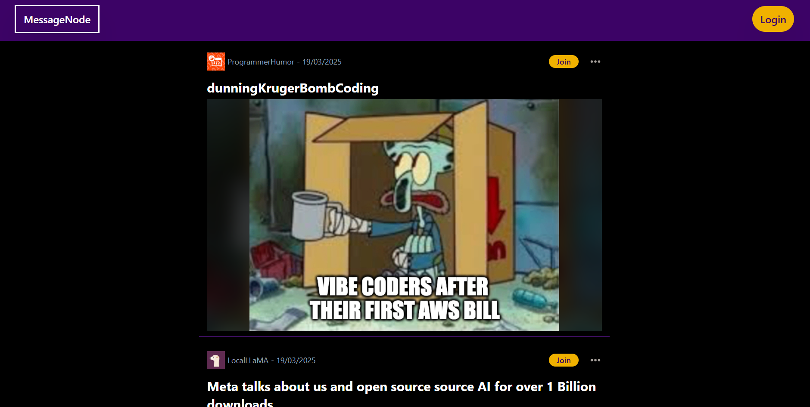
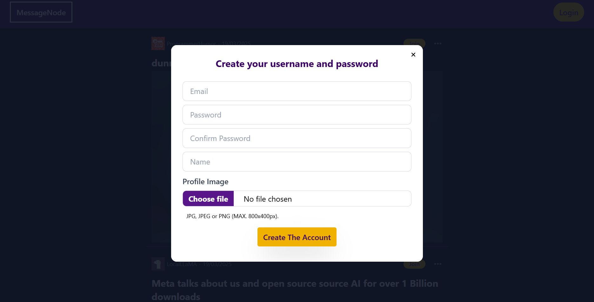
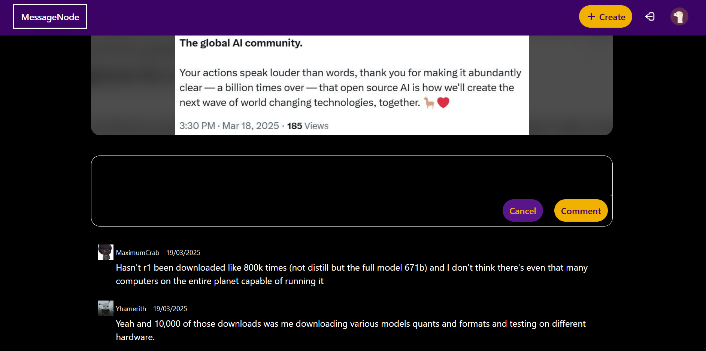

# MessageNode

Welcome to the Messagenode! Message node is community-driven platform inspired by Reddit. Registered users can create posts and comments. Visitors are welcome to browse and enjoy the content.

This project is a full-stack project with a modern frontend built using **React**, and a robust backend powered by **Node.js** and **Express**. It enables users to interact with a dynamic API and features real-time functionality.

This repo is the **Frontend** part of the project. Here is the link to the **Backend**.
https://github.com/yiwenwangANU/rest_api_backend

## Features ✨

- **Responsive UI:** Built with React and Tailwind CSS.
- **RESTful API:** Developed using Node.js and Express.
- **Authentication:** Secure login using JWT.
- **Authorization :** Logined user is authorized to create, edit, and delete his/her own posts

## Preview





## Getting Started 🚀

### Installation

Clone the repository and install the dependencies:

```
git clone https://github.com/yiwenwangANU/rest_api_frontend.git
cd rest_api_frontend
npm install
```

### Environment Variables

Create .env file in the root dir that contains the variable that indicate URL with port of backend

- _VITE_API_BASE_URL_

### Running Locally

Start the development server:

```
npm run dev
```

Your app will be available at http://localhost:5173.

## NPM Packages used 📦

- **Global State Management:**  
  Utilized React Context API to manage and share global state across the application.

- **Styling:**  
  Leveraged [Tailwind CSS](https://tailwindcss.com/) for a utility-first approach to styling.

- **Routing:**  
  Managed navigation and route handling using [react-router](https://reactrouter.com/).

- **Form Handling:**  
  Adopted [react-hook-form](https://react-hook-form.com/) for seamless form validation and submission.

- **Data Fetching & Caching:**  
  Leveraged [react-query](https://react-query.tanstack.com/) for fetching data, caching query results, and managing cache invalidation. Combined with [react-intersection-observer](https://www.npmjs.com/package/react-intersection-observer) and `useInfiniteQuery` to implement infinite scrolling, allowing continuous content loading without pagination controls.

- **API Requests:**  
  Utilized [axios](https://axios-http.com/) to make API requests to the backend. An `axiosInstance` is configured to include the JWT in the Authorization header for secure communication.
- **Date Formatting:**  
  Employed [date-fns](https://date-fns.org/) to format dates in a user-friendly way.

- **Image Compression:**  
  Used [browser-image-compression](https://www.npmjs.com/package/browser-image-compression) to efficiently compress post images and user avatars before upload.

- **Notifications:**  
  Integrated [react-toastify](https://fkhadra.github.io/react-toastify/) to display success and error messages for API requests.

- **JWT Management:**  
  Used [jwt-decode](https://www.npmjs.com/package/jwt-decode) to decode JWT tokens. The application checks token expiration and automatically deletes the token, username, and avatar if the token has expired.
